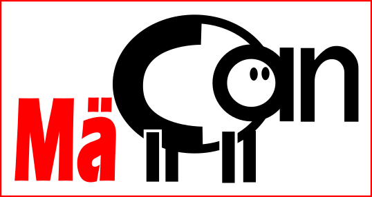

# MäCAN-Project

Hier entsteht ein System zur digitalen Steuerung einer Modellbahn, das auf dem CAN-Bus-Protokoll von Märklin basiert. Ziel ist es, eine preisgünstige und frei zugängliche Lösung zu schaffen.

